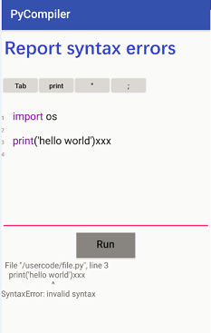

# app_python_compiler
Android APP for editing and running python code.

# 1. competitor analysis

* https://play.google.com/store/apps/details?id=coding.yu.pythoncompiler
   * Python编译器

* https://play.google.com/store/apps/details?id=org.qpython.qpy3
   * QPython3 - Python3 for Android
   
   
* https://play.google.com/store/apps/details?id=ru.iiec.pydroid3
   * Pydroid 3 - Educational IDE for Python 3

   
   
# 2. versions 

PyCompiler_v10.zip: init app project by android studio.
PyCompiler_v11.zip: Completed class CodeEditText for line number and keyword highlight.
PyCompiler_v12.zip: Completed basic layout.
PyCompiler_v13.zip: Completed compile and get output.
PyCompiler_v14.zip: Add new keywords pattern for python.
PyCompiler_v15.zip: Add G11n and Admob, publish to Google Play as v1.0.

# 3. screenshot

# 4. Google Play download link

Download [here](https://play.google.com/store/apps/details?id=compilers.ybdesire.com.pycompiler)
